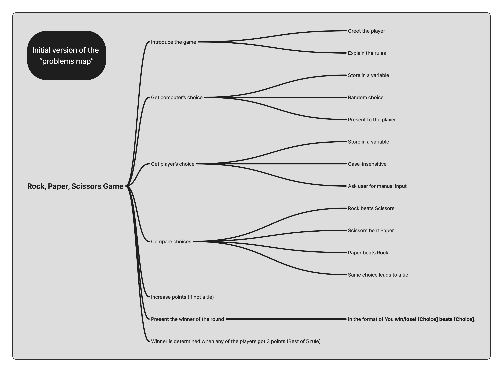
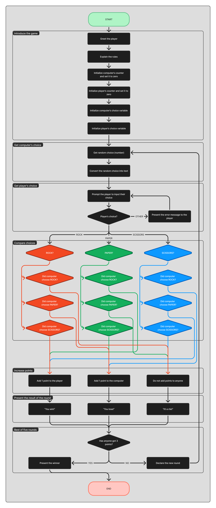
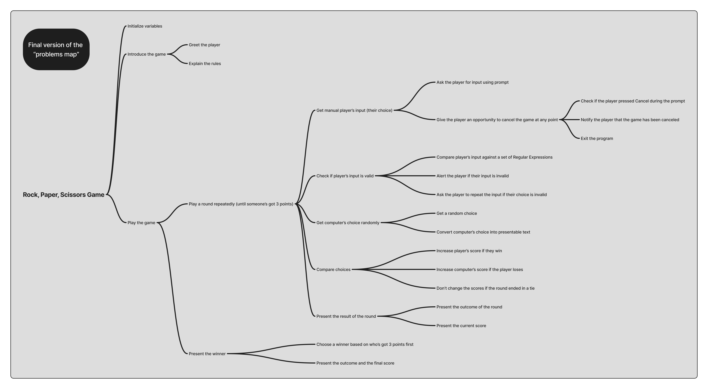

# Rock, Paper, Scissors in JS (TOP Project)
This is a repository for a game of Rock, Paper, Scissors written in JavaScript that is played in the console of browser developer tools.

This project was completed as an [assignment](https://www.theodinproject.com/lessons/foundations-rock-paper-scissors#assignment) for the [Foundations Course](https://www.theodinproject.com/paths/foundations/courses/foundations) of [The Odin Project](https://www.theodinproject.com/).

While working on this project, I have attempted to apply problem solving approach. After understanding the problem, I have divided it into smaller, more manageable problems. As a result, I had the following "problem map":

Moving forward in the the planning stage of the process, I have also created the following flowchart diagram in an attempt to better understand the problems and what functions my my program will have to operate on:

After that was done, I wrote a pseudocode based on the "problem map" and the diagram I have prepared (available at [this](https://github.com/ArtemSPopov/rock-paper-scissors/commit/a4bceae9a13773faa9236d70aef50d6e317b56b5) commit).

Eventually, in the process of writing code for the project, I had been encountering many unexpected problems with logic of certain functions, which I had to rewrite multiple times. The reason for that was that I have decided to introduce a few features that were beyond the scope of the Odin Project assignment:
- the game is played in the Best of Five format (first to get 3 points, wins);
- "Cancel" button of the prompt is fully integrated and ends the game at any point, presenting the results thus far;
- user's input is validated against a Regular Expression, and in the case of wrong input, the user is prompted to repeat the input;
- the score after each round as well as after the game is presented to the user;
- almost all outputs in the console are styled.

With every new problem arising, I was attempting to deal with them using the same problem solving approach. After several rewrites and iterations, final versions of the "problem map" and the flowchart diagram were as follows:

---

Please feel free to share your suggestions and critiques of anything you can find in this repository (even commits, as I am still trying to figure out my approach with them)! I will be incredibly grateful to receive any feedback and to learn how I can do better and improve my projects!

Thank you very much for taking the time to read this and to look at my project!